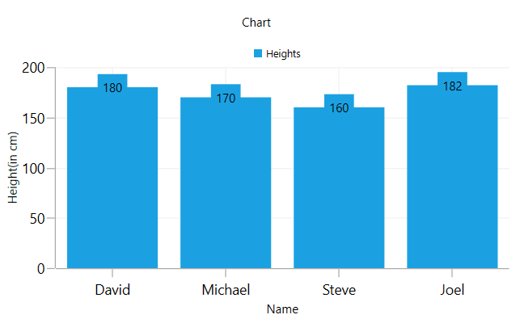

# Getting Started with WPF Charts (SfChart)

This sample demonstrates how to create and configure a [Syncfusion WPF Chart (SfChart)](https://www.syncfusion.com/wpf-controls/charts) with data binding, title, data labels, legend, and tooltips.

## Table of Contents

- [Prerequisites](#prerequisites)
- [Adding Chart Reference](#adding-chart-reference)
- [Initialize Chart](#initialize-chart)
- [Initialize View Model](#initialize-view-model)
- [Populate Chart with Data](#populate-chart-with-data)
- [Add Title](#add-title)
- [Enable Data Labels](#enable-data-labels)
- [Enable Legend](#enable-legend)
- [Enable Tooltip](#enable-tooltip)
- [Output](#output)

---

## Prerequisites

- Visual Studio 2022 or later
- .NET 6.0 / .NET 8.0 / .NET 10.0 (Windows)
- Syncfusion NuGet packages

---

## Adding Chart Reference

Install the **Syncfusion.SfChart.WPF** NuGet package into your WPF project.

**Using NuGet Package Manager:**

Search for `Syncfusion.SfChart.WPF` in the NuGet Package Manager and install it.

**Using .NET CLI:**

```bash
dotnet add package Syncfusion.SfChart.WPF
```

**Package Reference in `.csproj`:**

```xml
<ItemGroup>
    <PackageReference Include="Syncfusion.SfChart.WPF" Version="*" />
</ItemGroup>
```

> Refer to [this article](https://help.syncfusion.com/wpf/add-syncfusion-controls) to learn how to add Syncfusion controls to Visual Studio projects in various ways.

---

## Initialize Chart

Import the WPF Chart namespace in your `MainWindow.xaml`:

```xml
xmlns:syncfusion="clr-namespace:Syncfusion.UI.Xaml.Charts;assembly=Syncfusion.SfChart.WPF"
```

Then initialize an empty `SfChart` with two axes as shown below:

```xml
<syncfusion:SfChart>
    <syncfusion:SfChart.PrimaryAxis>
        <syncfusion:CategoryAxis />
    </syncfusion:SfChart.PrimaryAxis>
    <syncfusion:SfChart.SecondaryAxis>
        <syncfusion:NumericalAxis />
    </syncfusion:SfChart.SecondaryAxis>
</syncfusion:SfChart>
```

> **Note:** `SfChart` supports default axes, so `PrimaryAxis` and `SecondaryAxis` will be generated automatically based on the data bound to the chart if you don't specify them explicitly.

---

## Initialize View Model

Define a simple data model that represents a data point in the chart.

**Person.cs**

```csharp
namespace GettingStartedChart
{
    public class Person
    {
        public string Name { get; set; }

        public double Height { get; set; }
    }
}
```

Next, create a `ViewModel` class and initialize a list of `Person` objects:

**ViewModel.cs**

```csharp
using System.Collections.Generic;

namespace GettingStartedChart
{
    public class ViewModel
    {
        public List<Person> Data { get; set; }

        public ViewModel()
        {
            Data = new List<Person>()
            {
                new Person { Name = "David",   Height = 180 },
                new Person { Name = "Michael", Height = 170 },
                new Person { Name = "Steve",   Height = 160 },
                new Person { Name = "Joel",    Height = 182 }
            };
        }
    }
}
```

Set the `ViewModel` instance as the `DataContext` of your window in XAML:

```xml
<Window x:Class="GettingStartedChart.MainWindow"
        xmlns="http://schemas.microsoft.com/winfx/2006/xaml/presentation"
        xmlns:x="http://schemas.microsoft.com/winfx/2006/xaml"
        xmlns:local="clr-namespace:GettingStartedChart"
        xmlns:syncfusion="clr-namespace:Syncfusion.UI.Xaml.Charts;assembly=Syncfusion.SfChart.WPF"
        Title="MainWindow" Height="450" Width="800">

    <!--Setting DataContext for SfChart-->
    <Window.DataContext>
        <local:ViewModel/>
    </Window.DataContext>

</Window>
```

---

## Populate Chart with Data

Add a `ColumnSeries` to `SfChart.Series` and bind the `Data` property from the `ViewModel` to the `ItemsSource` property. Set `XBindingPath` and `YBindingPath` to map the model properties to the chart axes.

```xml
<syncfusion:SfChart>

    <syncfusion:SfChart.PrimaryAxis>
        <syncfusion:CategoryAxis Header="Name" FontSize="14"/>
    </syncfusion:SfChart.PrimaryAxis>

    <syncfusion:SfChart.SecondaryAxis>
        <syncfusion:NumericalAxis Header="Height(in cm)" FontSize="14"/>
    </syncfusion:SfChart.SecondaryAxis>

    <syncfusion:ColumnSeries ItemsSource="{Binding Data}"
                             XBindingPath="Name"
                             YBindingPath="Height" />

</syncfusion:SfChart>
```

> **Note:** You must set `XBindingPath` and `YBindingPath` so that `SfChart` can fetch values from the respective properties in the data model to plot the series.

---

## Add Title

The `Header` property of the chart acts as the title, providing quick information about the data being plotted.

```xml
<syncfusion:SfChart Header="Chart">
</syncfusion:SfChart>
```

---

## Enable Data Labels

Data labels improve the readability of the chart. Enable them using the `AdornmentsInfo` property of the `ChartSeries` by setting `ShowLabel` to `True`.

```xml
<syncfusion:SfChart>

    <syncfusion:ColumnSeries ItemsSource="{Binding Data}"
                             XBindingPath="Name"
                             YBindingPath="Height">
        <syncfusion:ColumnSeries.AdornmentsInfo>
            <syncfusion:ChartAdornmentInfo ShowLabel="True"/>
        </syncfusion:ColumnSeries.AdornmentsInfo>
    </syncfusion:ColumnSeries>

</syncfusion:SfChart>
```

---

## Enable Legend

Enable the chart legend using the `SfChart.Legend` property. Also set the `Label` property on each series so it appears in the legend.

```xml
<syncfusion:SfChart>

    <syncfusion:SfChart.Legend>
        <syncfusion:ChartLegend/>
    </syncfusion:SfChart.Legend>

    <syncfusion:ColumnSeries Label="Heights"
                             ItemsSource="{Binding Data}"
                             XBindingPath="Name"
                             YBindingPath="Height" />

</syncfusion:SfChart>
```

---

## Enable Tooltip

Tooltips show information about a segment when the user clicks on it. Enable tooltips by setting `ShowTooltip` to `True` on the series.

```xml
<syncfusion:SfChart>

    <syncfusion:ColumnSeries ShowTooltip="True"
                             ItemsSource="{Binding Data}"
                             XBindingPath="Name"
                             YBindingPath="Height" />

</syncfusion:SfChart>
```

---

## Output

The following is the complete `MainWindow.xaml` combining all the above configurations:

```xml
<Window x:Class="GettingStartedChart.MainWindow"
        xmlns="http://schemas.microsoft.com/winfx/2006/xaml/presentation"
        xmlns:x="http://schemas.microsoft.com/winfx/2006/xaml"
        xmlns:d="http://schemas.microsoft.com/expression/blend/2008"
        xmlns:mc="http://schemas.openxmlformats.org/markup-compatibility/2006"
        xmlns:syncfusion="clr-namespace:Syncfusion.UI.Xaml.Charts;assembly=Syncfusion.SfChart.WPF"
        xmlns:local="clr-namespace:GettingStartedChart"
        mc:Ignorable="d"
        Title="MainWindow" Height="450" Width="800">

    <!--Setting DataContext for SfChart-->
    <Window.DataContext>
        <local:ViewModel/>
    </Window.DataContext>

    <Grid>

        <syncfusion:SfChart Header="Chart" Height="300" Width="500">

            <!--Initialize the horizontal axis for SfChart-->
            <syncfusion:SfChart.PrimaryAxis>
                <syncfusion:CategoryAxis Header="Name" FontSize="14"/>
            </syncfusion:SfChart.PrimaryAxis>

            <!--Initialize the vertical axis for SfChart-->
            <syncfusion:SfChart.SecondaryAxis>
                <syncfusion:NumericalAxis Header="Height(in cm)" FontSize="14"/>
            </syncfusion:SfChart.SecondaryAxis>

            <!--Adding Legend to the SfChart-->
            <syncfusion:SfChart.Legend>
                <syncfusion:ChartLegend/>
            </syncfusion:SfChart.Legend>

            <!--Initialize the series for SfChart-->
            <syncfusion:ColumnSeries Label="Heights"
                                     ItemsSource="{Binding Data}"
                                     XBindingPath="Name"
                                     YBindingPath="Height"
                                     ShowTooltip="True">
                <syncfusion:ColumnSeries.AdornmentsInfo>
                    <syncfusion:ChartAdornmentInfo ShowLabel="True"/>
                </syncfusion:ColumnSeries.AdornmentsInfo>
            </syncfusion:ColumnSeries>

        </syncfusion:SfChart>

    </Grid>
</Window>
```

The chart rendered as a result of the above code:



---

## Theme

`SfChart` supports various built-in themes. Refer to the links below to apply themes:

- [Apply theme using SfSkinManager](https://help.syncfusion.com/wpf/themes/skin-manager)
- [Create a custom theme using ThemeStudio](https://help.syncfusion.com/wpf/themes/theme-studio#creating-custom-theme)

---

## See Also

- [WPF Charts Feature Tour](https://www.syncfusion.com/wpf-controls/charts)
- [WPF Charts Examples on GitHub](https://github.com/syncfusion/wpf-demos/tree/master/chart/Views)
- [How to create chart in C# WPF](https://support.syncfusion.com/kb/article/9466/how-to-create-chart-control-example-in-c-wpf)
- [How to create a chart control in WPF application using XAML](https://support.syncfusion.com/kb/article/9513/how-to-create-a-chart-control-in-wpf-application-using-xaml)
- [How to create a real time Chart using MVVM in WPF](https://support.syncfusion.com/kb/article/10039/how-to-create-a-real-time-chart-sfchart-using-mvvm-in-wpf)
